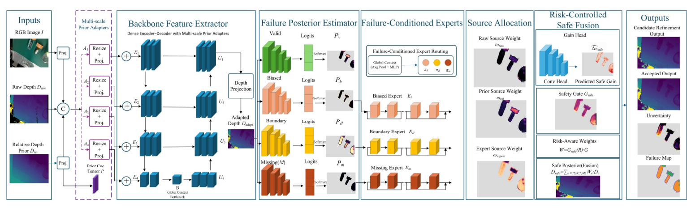

# FAPR-Depth

Official research-code release template for:

**FAPR-Depth: Failure-Aware Posterior Refinement with Risk-Controlled Fusion for Transparent Object Depth Completion**

> Release status: the verified research scripts are included, while datasets,
> third-party backbone code, cache shards, and trained weights are intentionally
> excluded. Add and verify those assets before making the repository public.

<p align="center">
  
</p>

## Overview

FAPR-Depth formulates transparent-object depth completion as selective
correction under heterogeneous RGB-D sensor failures. It combines:

1. a four-state failure posterior: valid, missing, biased, and boundary;
2. three failure-conditioned correction experts;
3. adaptive allocation among raw, relative-prior, and expert depth sources;
4. risk-controlled safe-anchor fusion;
5. bounded candidate refinement and acceptance control.

## Main TransCG result

| RMSE ↓ | REL ↓ | MAE ↓ | δ1.05 ↑ | δ1.10 ↑ | δ1.25 ↑ | Boundary ↓ | Score ↓ |
|---:|---:|---:|---:|---:|---:|---:|---:|
| 0.011437 | 0.015118 | 0.006967 | 94.2699 | 98.7842 | 99.9209 | 0.004011 | 0.021131 |

The benchmark row corresponds to the candidate output selected on validation.

## Repository structure

```text
FAPR-Depth/
├── assets/
├── configs/
├── datasets/
├── models/
├── analysis/
├── cross_dataset/
├── experiments/
├── research_code/stages/
├── sample_data/
├── scripts/
├── third_party/
├── weights/
├── train.py
├── test.py
├── inference.py
├── sample_inference.py
├── requirements.txt
├── environment.yml
├── LICENSE.txt
└── README.md
```

## Installation

```bash
conda env create -f environment.yml
conda activate fapr-depth
```

or:

```bash
python -m venv .venv
source .venv/bin/activate
pip install -r requirements.txt
```

## External requirements

1. Download the public datasets from their original providers.
2. Prepare the cache layout described in `datasets/README.md`.
3. Place the compatible base-completion source at
   `third_party/FDCT-main/Model.py`, or set `FAPR_BASE_SOURCE_ROOT`.
4. Place the required checkpoints in `weights/`, or set environment variables.

Copy `.env.example` and adjust paths for your machine.

## Training

The final v6 stage uses a `2/1/1/2` curriculum:

- 2 epochs safe-anchor warm-up;
- 1 epoch candidate adaptation;
- 1 epoch risk calibration;
- 2 epochs joint optimization.

```bash
bash scripts/train.sh
```

The final v6 stage initializes from the completed v5 checkpoint. Earlier
research stages are retained in `research_code/stages/`.

## Evaluation

```bash
bash scripts/test.sh
```

The complete evaluator reports sample-mean metrics, pixel-pooled diagnostics,
failure-posterior quality, gate behavior, and checkpoint-role comparisons.

## Single-shard inference

```bash
python inference.py   --cache-shard sample_data/example.pt   --checkpoint weights/best_candidate.pth   --base-source-root third_party/FDCT-main   --output-dir outputs/demo
```

## Analysis

```bash
bash scripts/analyze.sh
```

Additional scripts reproduce failure-posterior, expert-routing, region-wise,
risk, robustness, cross-dataset, and efficiency analyses.

## Data and weights

The datasets are not redistributed. The pretrained weights may be distributed
as GitHub Release assets after all co-authors approve the release. Do not commit
large checkpoints directly unless Git LFS is configured.

## Citation

```bibtex
@article{liu2026faprdepth,
  title={FAPR-Depth: Failure-Aware Posterior Refinement with Risk-Controlled Fusion for Transparent Object Depth Completion},
  author={Liu, Zhimin and Sun, Ruhao and Wang, Dongmin and Li, Dong},
  year={2026}
}
```

Update the venue, DOI, and page information after publication.

## License

The repository template uses the MIT License. Confirm the final license with all
co-authors and retain all third-party notices.
